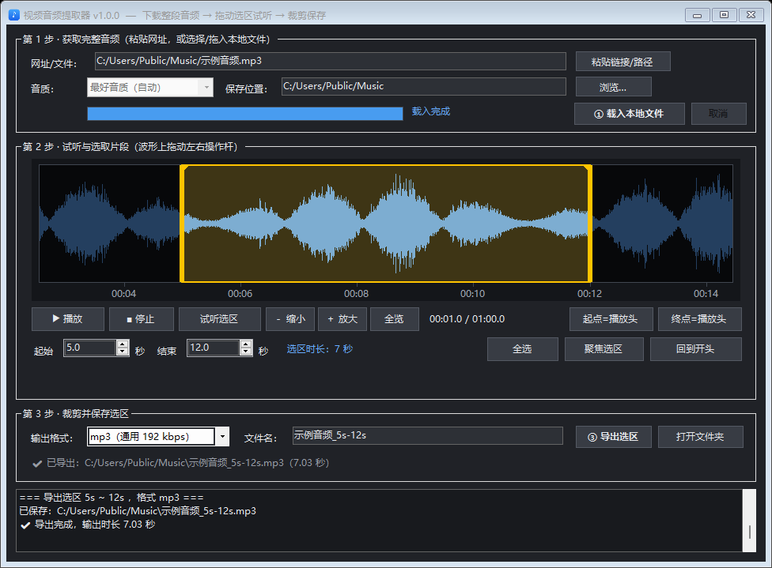
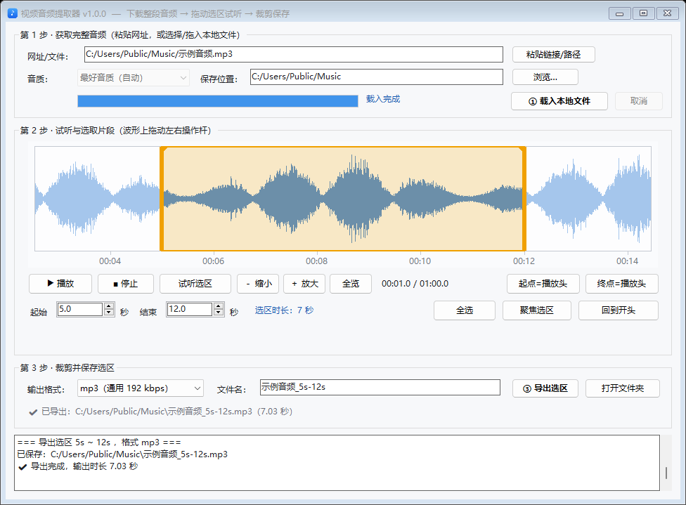

# 视频音频提取器 · Media Audio Extractor

**v1.0.0** ｜ 作者 **StarAsh042** ｜ 许可 **MIT**

> 一个单文件、免安装的 Windows 界面程序：粘贴视频网址（或直接选择本地音频/视频文件）→ 获取整段音频 → 在波形上拖动操作杆试听选取起止 → 裁剪导出。
> 内置 yt-dlp 与 ffmpeg，不依赖 Python / Node / 系统 PATH；界面明暗**跟随系统主题**。
>
> A single-file, portable Windows GUI tool: paste a video URL (or open a local audio/video file),
> fetch the full audio track, pick a start/end range by dragging handles on the waveform, then export the clip.
> yt-dlp and ffmpeg are embedded — no Python/Node required. The UI follows the system light/dark theme.

---

## 界面

深色（跟随系统）：



浅色：



## 功能

- **三步流程**：① 获取完整音频（下载网址，或载入本地文件）→ ② 波形试听与选区 → ③ 裁剪导出
- **本地文件**：网址栏也可直接填本地音频/视频路径，支持**把文件拖进窗口**、粘贴路径（含资源管理器「复制为路径」带的引号）；跳过下载直接进入波形选区，且不会多复制一份完整音频
- **边解码边画波形**：解码与包络计算在同一次 ffmpeg 调用里完成，波形随解码进度**从左往右长出来**（长音频实测 0.5 秒内就能看到波形，而不是干等十几秒），进度条同步显示百分比，界面全程可响应
- **波形选区**：黄色左右操作杆拖动即可选取起止；拖选区中间整体平移；点击波形定位播放头
- **默认选区**：载入后自动选中**总时长的中间三分之一**，以此为起点向两侧微调更顺手（极短音频则退化为整段）
- **精确到 0.1 秒**：起始/结束数值框与波形双向同步；支持「起点=播放头 / 终点=播放头」
- **缩放到细节**：滚轮缩放、右键拖动平移、一键「聚焦选区」「全览」；放大后按可视区间重算高分辨率波形包络
- **可试听**：播放 / 暂停 / 停止 / **只播放当前选区**；试听**直接播放原文件**（WAV 走系统 MCI，m4a / mp3 等走「内置 ffmpeg + waveOut」），无需第三方音频库
- **音质可选**：最好音质（自动）/ 标准（≤128 kbps）/ 省流量（≤64 kbps）
- **输出格式**：mp3（192 kbps）/ m4a（原始音质直通，不转码）/ wav（无损）
- **明暗跟随系统**：读取系统设置并在 `WM_SETTINGCHANGE` 时实时切换，深色下标题栏一并变深
- **中文友好**：中文标题、中文/含空格路径都不会出错（内部临时文件全部走 ASCII 路径）
- **1000+ 站点**：由 yt-dlp 提供解析能力（B 站 / YouTube 等）
- **命令行模式**：便于批量与脚本调用，见下文

## 快速开始

### 方式一：直接使用构建好的程序

```
dist\视频音频提取器.exe
```

双击运行即可（Windows 10 / 11，依赖系统自带的 .NET Framework 4.x）。

> 首次运行会把内置组件解压到 `%LOCALAPPDATA%\MediaAudioExtractor\bin`（约 100 MB，仅一次，几秒），之后启动秒开。
> 删除该目录不影响程序，下次运行会重新解压。

### 方式二：从源码构建

```powershell
git clone https://github.com/StarAsh042/media-audio-extractor.git
cd media-audio-extractor

# 1) 获取内置组件（二进制不入库，脚本自动下载 yt-dlp 与 ffmpeg）
powershell -ExecutionPolicy Bypass -File tools\fetch-tools.ps1

# 2) 编译（输出 dist\MediaAudioExtractor.exe，约 100 MB）
powershell -ExecutionPolicy Bypass -File build.ps1
```

- 编译器使用 Windows 自带的 `csc.exe`（.NET Framework 4.x），**无需安装 Visual Studio / .NET SDK**。
- `build.ps1` 在缺少 `tools\yt-dlp.exe` 或 `tools\ffmpeg.exe` 时会自动调用 `fetch-tools.ps1`。
- `fetch-tools.ps1` **固定到具体版本并校验 SHA-256**（当前为 yt-dlp `2026.08.19`、ffmpeg `7.1`）。
  上游若发布新版本，脚本会校验失败并提示更新 —— 这是刻意的 fail-closed，避免悄悄换用未经审阅的二进制。
  升级时改脚本顶部那四个变量即可；`-NoRun` 可只下载校验、不执行它们。
- 源码为 **C# 5** 语法（兼容自带编译器）：请勿使用字符串插值、`?.`、表达式体成员等新语法。

## 使用说明

### 第 1 步 · 获取完整音频

| 控件 | 说明 |
|---|---|
| 网址/文件 | 网址：支持 B 站、YouTube 等 1000+ 站点，可直接粘贴分享文本（自动提取链接）。本地文件：填**本地音频/视频文件的完整路径**即可；把文件或链接**直接拖进窗口**、或用「粘贴链接/路径」按钮都行 |
| 音质 | 最好音质（自动）/ 标准（≤128 kbps）/ 省流量（≤64 kbps）。**本地文件模式下自动置灰**（不适用） |
| 保存位置 | 网址模式：完整音频保存到该目录，文件名取视频标题。本地文件模式：不再复制一份完整音频，该目录仅作为第 3 步的导出目录 |
| ① 下载完整音频 / 载入本地文件 | 按钮文案随输入自动切换：网址则下载音轨、本地文件则直接载入 → 生成试听文件 → 解析波形；下载中可随时「取消」 |

### 第 2 步 · 试听与选取片段

| 控件 | 说明 |
|---|---|
| 波形区 | 蓝色波形 + 时间刻度；**黄色左右操作杆**调整起止；拖选区中间整体平移；点击波形定位播放头 |
| ▶ 播放 / ■ 停止 / 试听选区 | 播放整段 / 从播放头播放 / 只播放当前选区 |
| － 缩小 / ＋ 放大 / 全览 | 缩放视图（也可**滚轮**缩放、**按住右键拖动**平移） |
| 起点=播放头 / 终点=播放头 | 把当前播放位置设为选区起点 / 终点 |
| 起始 / 结束 | 精确到 0.1 秒的数值微调，与波形操作杆双向同步 |
| 全选 / 聚焦选区 / 回到开头 | 选中整段 / 视图放大到选区 / 播放头归零 |

### 第 3 步 · 裁剪并保存选区

选择输出格式与文件名（默认自动带标题与起止秒数）→ 点「③ 导出选区」；
「打开文件夹」可直接定位到成品。文件名示例：

```
胖东来也能Asmr…晚安！_46s-93s.mp3      # 默认选区 = 总时长的中间三分之一
胖东来也能Asmr…晚安！_60s-68s.m4a
胖东来也能Asmr…晚安！_完整音频.m4a
```

## 命令行模式

```powershell
# 一次性下载并裁剪片段（快速通道：只下载所需的那几秒）
视频音频提取器.exe --cli --url <网址> --out <目录> [--start 0] [--dur 15] [--format mp3|m4a|wav] [--no-section]

# 只下载完整音频（对应第 1 步）
视频音频提取器.exe --cli --full --url <网址> --out <目录> [--quality best|std|low]

# 从本地文件裁剪（对应第 3 步）
视频音频提取器.exe --cli --cut <本地文件> --out <目录> [--start 0] [--end 15] [--format mp3] [--name 名称]

# 其它工具
视频音频提取器.exe --cli --preview <本地文件> --wav <输出.wav> [--rate 44100]
视频音频提取器.exe --cli --peaks <wav> [--buckets 1000]
```

| 参数 | 说明 |
|---|---|
| `--start` / `--end` | 起止秒数（`--end` 为绝对时间，`--dur` 为时长） |
| `--dur` | 省略或为 `0` 表示整段音频 |
| `--no-section` | 不使用「只下载所需片段」的快速通道，改为整段下载后再裁剪（少数站点/网络下更稳） |
| `--quality` | `best` / `std` / `low`，仅 `--full` 使用 |

退出码：`0` 成功，`1` 失败，`2` 参数错误。

## 工作原理

1. **下载**：`yt-dlp -f <音质选择> -o media.%(ext)s`；标题用 `--print-to-file` 单独取得。
   临时文件全部使用 ASCII 路径，成品再由 .NET 复制到目标目录 —— 中文标题、中文/含空格路径都不会出错。
   一次性片段模式还会用 `--download-sections` 只从 CDN 拉取所需的那几秒（比整段下载快一个数量级）。
2. **试听**：直接用**原文件**播放 —— WAV 走 winmm **MCI**，其余格式（m4a / mp3 / …）走
   「内置 ffmpeg 解码 → `waveOut` 流式输出」。两条路都支持精确定位与「播放 A~B 区间」，
   且不需要任何第三方音频库。
   （之所以不用 WPF 的 `MediaPlayer`：实测它打不开 m4a，那套栈对 MP4/AAC 支持不可靠。）
3. **波形**：解码时**顺带**算包络 —— 一次 ffmpeg 调用同时把 PCM 写到管道（供边解码边画）和写成 WAV
   （供放大时按区间快速读取）。因此波形是**渐进**出现的：长音频实测 0.5 秒内就能看到波形开始生长，
   而不是干等到解码结束。放大时只读取可视区间重算，兼顾细节与流畅度。
4. **裁剪**：ffmpeg `-ss/-t`；mp3 用 libmp3lame，m4a 优先 `-c:a copy` 直通，wav 用 pcm_s16le。
5. **主题**：读取 `HKCU\...\Themes\Personalize\AppsUseLightTheme`，并监听 `WM_SETTINGCHANGE (ImmersiveColorSet)`
   实时切换；深色模式用 `DwmSetWindowAttribute` 把标题栏一并变深；进度条为自绘控件以保证配色一致。

## 参与开发

> **给外部贡献者的重要说明**
>
> `main` 分支受保护，且仅维护者可直接推送。
> **请向 `dev` 分支提交 Pull Request；直接向 `main` 提交的 PR 大概率不会受理。**

推荐流程：

1. Fork 本仓库到你自己账号
2. 从 `dev` 分支切出特性分支（`git checkout -b feature/xxx`）
3. 提交改动并推送到你的 Fork
4. 向本仓库的 **`dev` 分支** 开 Pull Request，等待 CI 通过与合并

分支流向：`feature/xxx` → `dev`（日常集成）→ `main`（发布版本）

---

## 项目结构

```
media-audio-extractor/
├── src/
│   └── MediaAudioExtractor.cs     # 全部源码（GUI + CLI + 播放器 + 波形控件）
├── assets/
│   ├── app.manifest               # DPI 感知 / 权限 / 兼容性声明
│   ├── icon.ico                   # 程序图标（多尺寸）
│   └── gen_icon.py                # 图标生成脚本（Pillow）
├── tools/
│   ├── fetch-tools.ps1            # 下载 yt-dlp / ffmpeg（二进制不入库）
│   └── README.md                  # 组件来源与许可证
├── docs/images/                   # README 截图
├── build.ps1                      # 一键构建（csc 内嵌组件生成单文件 exe）
├── dist/                          # 构建产物（已 gitignore）
├── CHANGELOG.md
├── LICENSE                        # MIT
└── README.md
```

## 自检模式（隐藏）

程序内置了无人值守自检，便于在 CI 或改动后快速回归：

```powershell
MediaAudioExtractor.exe --dumpui  shot.png [light|dark]   # 离屏渲染界面并校验控件越界/重叠
MediaAudioExtractor.exe --themetest shot.png [light|dark] # 模拟系统主题广播，验证运行时切换
MediaAudioExtractor.exe --uiauto "来源" "输出目录" 0 shot.png [light|dark] [第二个来源]
                                                          # 自动点击：载入 → 播放 → 缩放 → 平移 → 选区 → 导出
                                                          # 「平移」一步会输出 耗时/步 与 包络重算次数，
                                                          # 用于回归拖动手感（正常应为 0 次重算）
                                                          # 给了「第二个来源」会再载入一次，
                                                          # 用于回归「二次载入」（旧试听文件被占用）
```

「来源」既可以是网址，也可以是本地文件路径（自检全程无需外网，可配合本地 HTTP 服务使用）。

## 已知限制

- 需要系统安装 .NET Framework 4.x（Windows 10 / 11 默认自带）。
- 载入会生成一份临时 WAV 作为**波形缓存**（约 5 MB/分钟，超长音频自动降到 22.05 kHz），存放于 `%LOCALAPPDATA%\MediaAudioExtractor\work`，下次载入时自动清理。它只用于按区间快速读取波形，**试听不经过它**。
- 试听为「原文件直出」，但 m4a / mp3 等走 ffmpeg 实时解码为 44.1 kHz 单声道再输出；**导出文件仍是原始质量**（m4a 直通不受影响）。
- 1080P 及以上画质需要 B 站大会员，但音轨匿名即可获取，不影响本工具使用。
- 需要登录才能访问的内容请在浏览器中确认可播放；本工具暂不支持传入 Cookie。
- **不支持网络（UNC）路径**：`\\主机\共享\...` 形式的输入会被拒绝 —— 载入它会向该地址发起 SMB 连接并可能把本机 NTLM 凭据交给对方。请先把文件复制到本地磁盘再载入。

## 许可证

本仓库代码以 **MIT License** 发布，见 [LICENSE](LICENSE)。

内置的第三方组件：

- [yt-dlp](https://github.com/yt-dlp/yt-dlp) —— The Unlicense
- [FFmpeg](https://ffmpeg.org/)（gyan.dev essentials build）—— **GPL**（启用了 x264/x265 等 GPL 组件）

若你要再分发打包好的 exe，请一并遵守 GPL 的相关要求（提供对应源码或获取途径）。
